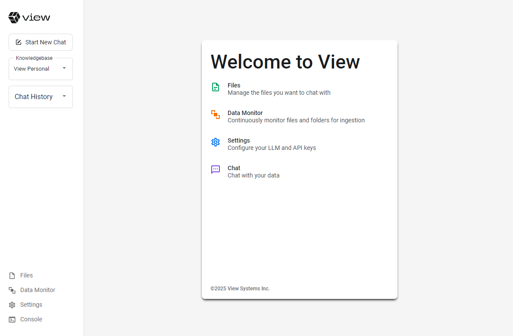
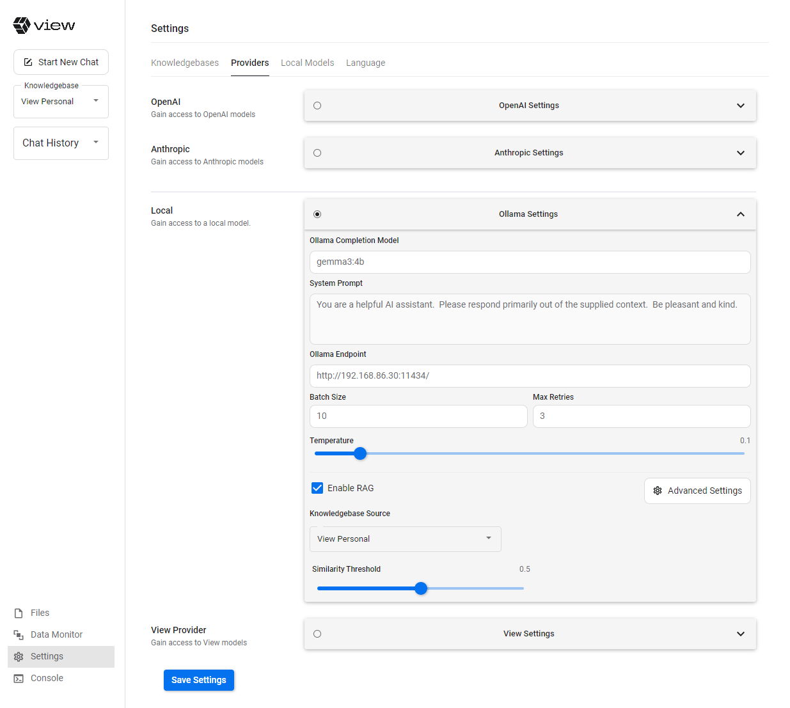
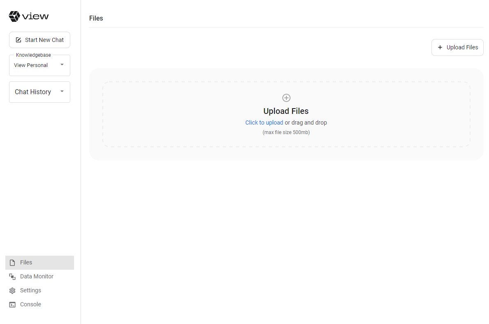
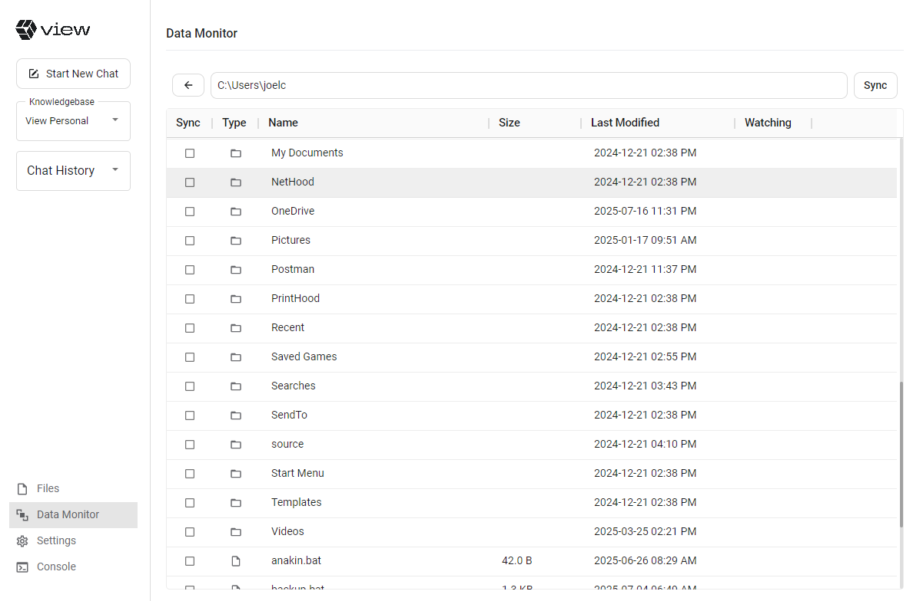

# Getting Started with View AI Personal

<p align="center">
  <br />
  <br />
  
  <br />
  <br />
</p>

<p align="center">
  <strong>Transform your personal documents into intelligent, searchable knowledge bases in minutes</strong>
  <br />
</p>

<p align="center">
  <a href="https://github.com/view-io/personal/releases">
    
  </a>
  <a href="https://github.com/view-io/personal/blob/main/LICENSE">
    
  </a>
  <a href="https://github.com/view-io/personal/issues">
    
  </a>
</p>

View AI Personal is a cross-platform desktop application that empowers you to create intelligent, searchable knowledge bases from your personal documents. Simply drag and drop your files, choose your preferred AI provider (local or cloud), and start having intelligent conversations with your data.

> **Note**: This application is in its early stages. Please be patient and kind as we continue to improve and expand its capabilities.

## System Requirements

The following are requirements for installing and using View AI Personal.

- A Windows or Mac machine (Apple Silicon is preferred)
- At least 8GB of RAM
- Enough disk capacity to hold local knowledgebases (see note below)
- Access to one of the following for embeddings and completions (see note below):
  - A local installation of Ollama (download and install on your machine from here: https://ollama.com/download)
  - A deployment of View's enterprise AI platform (endpoint and access key)
  - An OpenAI API key
  - An Anthropic (Claude) API key

### Disk Capacity

On knowledgebase sizing, View AI Personal will break documents into small contextual pieces, generate metadata, and generate vector embeddings. A fully parsed and processed document will result in AI artifacts that are anywhere from 1X to 5X the size of the original file. So if you plan to ingest 1GB of data, have 5GB of capacity of available.

### Embeddings and Completions

View AI relies on external services for embeddings and completions (though we have grand plans to change this!). You can use Ollama locally, Ollama on a remote machine, or an enterprise View AI deployment to provide this capability, and your data remains under your control.

If you use OpenAI or Anthropic for embeddings and completions, be sure to only ingest and work with data that you are comfortable sending to the Internet.

**Pro tip:** even desktop class gaming GPUs work great for completions - we've tested on RTX 2070s and seen completion performance that far exceeds what anyone would need for individual user experiences.

**Pro tip, again:** for smaller workloads (like individual user experiences) it's highly unlikely that you'll see a benefit from using a GPU for embeddings.

## Installation

### Easy Way - Installers

Download the installers from here: https://github.com/view-io/personal/releases

And forgive us, we don't have a code-signing certificate yet, so you will likely get warnings about whether or not you trust the supplier.

Once you have downloaded the installer, run it!

### Build from Source

Or, clone the repository and build (requires dotnet 9.0, which you can download from here: https://dotnet.microsoft.com/en-us/download/dotnet/9.0).

```bash
$ git clone https://github.com/view-io/personal
$ cd personal/src
$ dotnet build
$ cd View.Personal/bin/Debug/net9.0
$ ./View.Personal
```

## Using the App

Once you open the app, you'll see a screen that looks like this:



The first thing to configure is your settings. In settings, you will define your embeddings and completions providers.



Under providers, click the radio button next to either OpenAI, Anthropic, Local, or View. Specify the necessary configuration parameters for the provider you choose to use.

If you are using Ollama, be sure you go to the "Local Models" tab and pull the embedding model you plan to use, the completion model you plan to use, and configure those in the settings for Ollama embeddings and completions.

The recommended starting model for embedding is:
- all-minilm (384 dimensions)

**Pro tip:** for completions using Ollama, use a model that fits nicely into your GPU. Bigger is not always better. View generally recommends models in the 4b to 8b parameter range.

The recommended starting model for completions include:
- gemma3:4b
- qwen3:4b

## Ingesting Your Data

You can ingest data in one of two ways in View AI Personal: drag-and-drop in the Files section, or, set up a watcher on specific files and folders in the Data Monitor section.





Files ingested through the Files tab are not updated as you make changes to those files on your computer. To re-ingest, you have to drag and drop the back in.

Files ingested through the Data Monitor tab are continually updated as you make changes to those files on your computer, assuming the View Personal client is up and running. If you make changes while the app is not open, and wish to re-synchronize, click the Sync button.

### Ingestion Performance

A series of steps have to be performed against each file that is ingested into the system. This includes type detection, breaking of files into semantic cells, chunking those cells, generating embeddings, and storing them in the backend graph database. Usually most normal-sized files will complete in a matter of 15-20 seconds. If you have issues with certain files, file an issue, and we can help!

## Chatting with Your Data

Head on over to the left and click Start New Chat. Once you start a chat, it will be added to the list in the Chat History dropdown.

In the title bar, you'll notice an indicator of which completions provider you are using, and, which large language model (LLM) you are using.


Pop in a question related to your data! For this example, I loaded a series of documents about Botox, Dysport, Xeomin, and neurotoxins in general.


## File an Issue

Should you encounter any issues or have enhancement requests, please file an issue!
